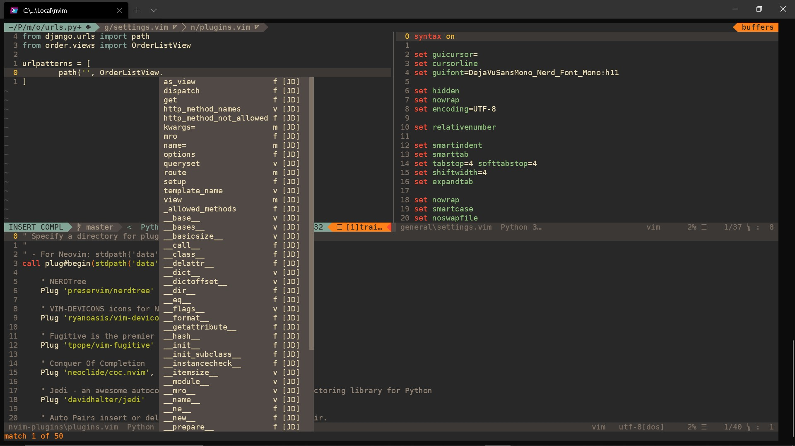

# nvim

                     __                         _   __      _
                    / /___  _________ ____     / | / /   __(_)___ ___
               __  / / __ \/ ___/ __ `/ _ \   /  |/ / | / / / __ `__ \
              / /_/ / /_/ / /  / /_/ /  __/  / /|  /| |/ / / / / / / /
              \____/\____/_/   \__, /\___/  /_/ |_/ |___/_/_/ /_/ /_/
                              /____/

## Introduction

## Instalación

### Dependencias

Los siguientes paquetes son requeridos para la instalación de los plugins.

1. 📦 Node.js https://nodejs.org/en/download/package-manager/
2. 📦 "vim-plug" https://github.com/junegunn/vim-plug
3. 📦 Pipenv
4. 📦 Nerd Font: https://github.com/ryanoasis/nerd-fonts

### Pasos:

Sigue los siguentes pasos para conufigurar NeoVim.

1. instalar pynvim en el ambiente virtual destinado a NeoVim.
2. Instalar el tipo de letra de "Nerd Font". Puedes instalar cualquiera de los tipos de letras en el sitio de Nerf Fonts, sin embargo el tipo de letra en mi configuración es "DejaVu Sans Mono Nerd Font"
    1. Una vez instalada el tipo de letra en tu sistema, seleccionala en tu terminal.

## Content

### Folder Structure

#### Plugins

#### Key Mappings

#### Themes

1. Command Promt:
   Utilizo Windows Terminal y mi línea de commandos (Command Prompt) está modificada para utilizar "PowerLine"

    Las instrucciones para instalar PowerLine se encuentran en https://docs.microsoft.com/en-us/windows/terminal/tutorials/powerline-setup
